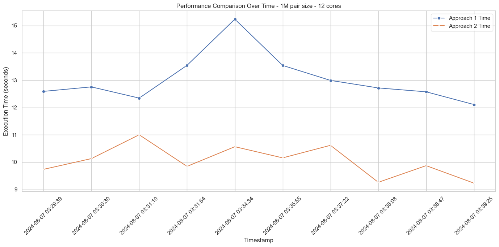
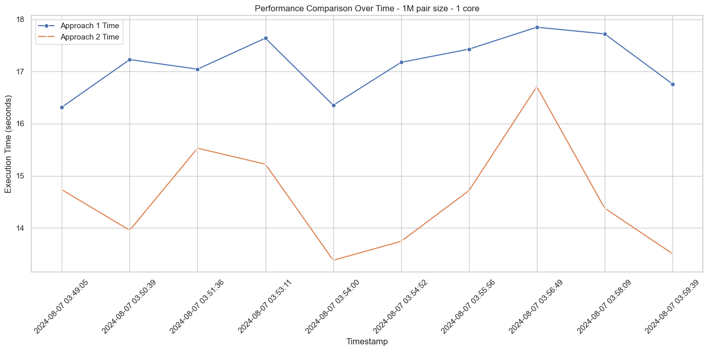
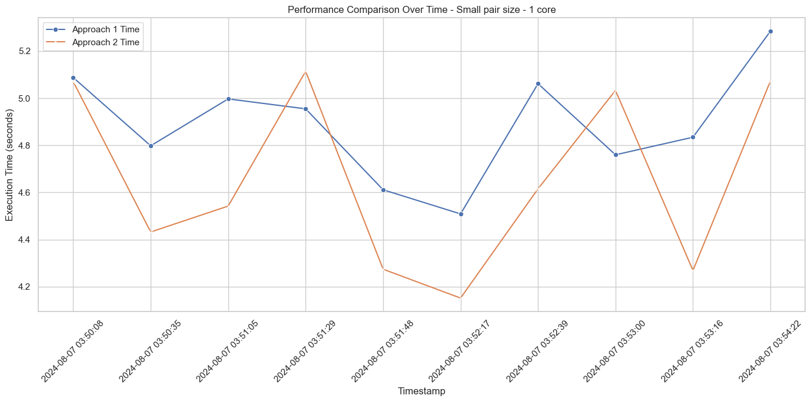
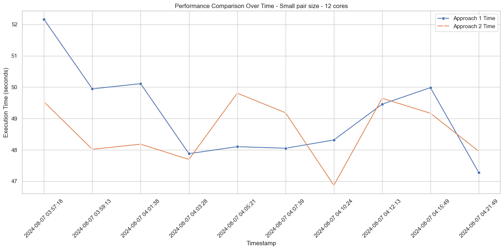
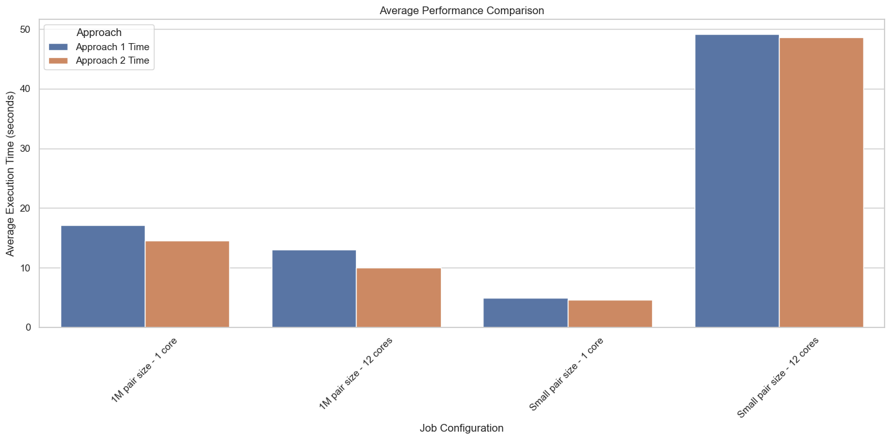

## Insights from the Average Execution Times:
### 1M Pair Size - 12 Cores:

- Approach 2 consistently performs better with lower execution times compared to Approach 1.
- The execution times for Approach 2 range from approximately 9 to 11 seconds, whereas for Approach 1, it ranges from approximately 12 to 15 seconds.
### 1M Pair Size - 1 Core:

- Both approaches have significantly higher execution times compared to the 12 cores configuration.
- Approach 2 again performs better than Approach 1, but the difference is less pronounced than in the 12 cores configuration.
### Small Pair Size - 1 Core:

- Both approaches have similar performance with slight variations in execution times.
- The execution times are much lower than the 1M pair size jobs, which is expected.
### Small Pair Size - 12 Cores:

- Surprisingly, the execution times are higher than the 1 core configuration for small pair sizes.
- This suggests that using multiple cores for small data sizes might introduce inefficiencies or overheads.
## Average Performance Comparison

## Conclusion:
- **`Core Count Impact`**: Increasing the number of cores significantly improves performance for large data sizes (1M pair size). However, for small data sizes, using multiple cores might introduce overheads that can negate the benefits.
- **`Approach Performance`**: Approach 2 generally outperforms Approach 1 across all configurations, indicating it might be more optimized or efficient.
- **`Job Size Impact`**: Execution times are naturally higher for larger data sizes, but the relative performance improvement from increasing core count is more pronounced for larger data sizes