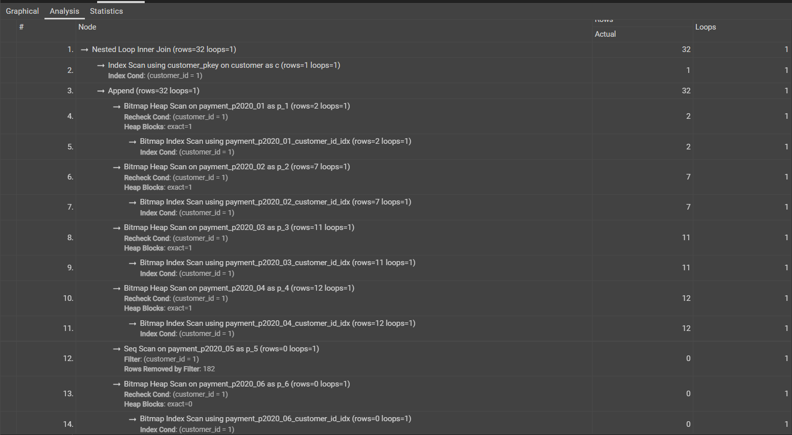
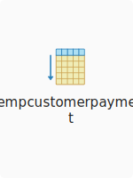
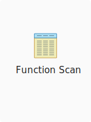

# Compare CTE, View, Temp Table, Table Variable, Inline TVFs
1. [CTE](#cte)
2. [View](#view)
3. [Temporary Table](#temp-table)
4. [Table Variable](#table-variable)
5. [Inline TVFs](#inline-tvfs)

[Some findings](#conclusion)
---
## CTE
- Result set of a query which exists temporarily and **for use only WITHIN context of a larger query**
- **NOT** stored and exists only for the duration of the query
- USE CASE:
    - need to refer a derived table multiple times in a single query (`select`, `insert`, `update`, ...)
    - alternative to create a view in db
    - perform same calculation multiple times over across multiple query components
    -> useful for readibility and recursion but not be the most performant option for large dataset
```sql
-- CTE (exists in a single query)
-- EXPLAIN ANALYZE
WITH CTE as (
	select customer_id, count(*) as OrderCount 
	from customer
	group by customer_id
)

select c.customer_id, cte.OrderCount, c.first_name, c.last_name
from customer c
join cte on c.customer_id=cte.customer_id;
```

```
"Planning Time: 0.172 ms"
"Execution Time: 0.413 ms"
```
## View
- Virtual tables provide a way to simplify complex queries, encapsulate logic and provide security
- Performance: can be indexed to improve performance, but without indexes they can perform similarly to a regular query since they don't store data themselves
```sql
-- VIEW (exists outside session)
CREATE VIEW CustomerPayment AS
SELECT C.customer_id, c.first_name, c.last_name, p.payment_id, p.payment_date
FROM customer C
JOIN payment P ON C.customer_id = P.customer_id;
-- EXPLAIN ANALYZE
SELECT * FROM CustomerPayment WHERE customer_id = 1;
```

```
-- FIRST TIME
"Planning Time: 10.840 ms"
"Execution Time: 2.129 ms"
-- OTHER NEXT TIMES
"Planning Time: 0.357 ms"
"Execution Time: 0.109 ms"
```
- **Problem**: That table will not be updated if data in the underlying tables change!
-> ` MATERIALIZED VIEW`: 
    - Data is stored physically
    - Performance ensured!
```sql
CREATE MATERIALIZED VIEW <view_name>
as query
REFRESH MATERIALIZED VIEW <view_name>
```
## Temporary Table
- store intermediate results that can be reused within the session, useful for complex processing and can be indexed
- only visible within the session in which they are created and are automatically dropped when the session ends
- Performance: consume more resources since they involve data storage, but they can be indexed for better performance with large datasets
```sql
-- Temporary Tables (just exist in session)
CREATE TEMPORARY TABLE TempCustomerPayment (
    customer_id INT,
    payment_id INT,
    payment_date TIMESTAMP
);

INSERT INTO TempCustomerPayment (customer_id, payment_id, payment_date)
SELECT customer_id, payment_id, payment_date
FROM payment;
-- EXPLAIN ANALYZE
SELECT * FROM TempCustomerPayment WHERE customer_id = 1;

-- DROP TABLE TempCustomerPayment;
```

```
-- FIRST TIME
"Planning Time: 3.996 ms"
"Execution Time: 8.167 ms"
-- OTHER NEXT TIMES
"Planning Time: 0.051 ms"
"Execution Time: 0.703 ms"
```
## Table Variable 
- a local variable that stores data temporarily - store small amounts of data
- scoped to the batch, stored procedure, or function
- Performance: generally faster for small datasets due to less logging and no statistics, BUT less efficient for large datasets

*Table Variable are a specific construction from MS-SQLServer that creates a temporary table inside a procedure, prefixed by @.*
```sql
DECLARE @TableVar TABLE (
    customer_id INT,
    payment_id INT,
    payment_date TIMESTAMP
);

INSERT INTO @TableVar (customer_id, payment_id, payment_date)
SELECT customer_id, payment_id, payment_date
FROM payment;

SELECT * FROM @TableVar WHERE customer_id = 1;
```
- In PostgreSQL:
    - every table name serves as type name for the row type (a.k.a. composite type) automatically - not as table type, there are **no "table types" or "table variables" in Postgres** (but there are typed tables)
    - there is **no direct equivalent of table variables** like in some other database management systems (e.g., SQL Server). However, you can achieve similar functionality using Common Table Expressions (CTEs) or temporary tables
## Inline TVFs
- return a table data type and can be used in the FROM clause of a query
- Useful for parameterized queries and encapsulating logic
- Performance: Inline TVFs are generally more efficient than multi-statement TVFs since they are treated as views with parameters.
```sql
-- INLINE TVFs (exists outside session)
CREATE OR REPLACE FUNCTION GetCustomerPayment(cust_id INT)
RETURNS TABLE(payment_id INT, payment_date TIMESTAMP) AS $$
BEGIN
    RETURN QUERY
    SELECT p.payment_id, p.payment_date AT TIME ZONE 'UTC' AS payment_date
    FROM payment p
    WHERE p.customer_id = cust_id;
END;
$$ LANGUAGE plpgsql;

-- Call the function
SELECT * FROM GetCustomerPayment(1);

DROP FUNCTION getcustomerpayment(integer)
```

```
-- FIRST TIME
"Planning Time: 0.098 ms"
"Execution Time: 0.528 ms"
-- OTHER NEXT TIMES
"Planning Time: 0.034 ms"
"Execution Time: 0.151 ms"
```

# Some findings
- `CTEs` are suitable for enhancing query readability and handling recursive queries but may not be optimal for large datasets due to re-computation.
- `Temporary tables` are better suited for more complex scenarios where you need to work with the temporary data across multiple queries within the same session.
- `CTE` is not quite as versatile as `temporary tables` and `table variables`, but for individual queries that require temporary/staged data it can be a good option to improve performance. 
- `Views` are ideal for encapsulating complex logic and providing a consistent view of data, especially when indexed or materialized for performance.
- `Table Variables`, although not directly available in PostgreSQL, can be replaced by CTEs for smaller datasets or temporary tables for larger ones.
- `Inline TVFs` are recommended for parameterized queries and encapsulating logic efficiently within the query execution.