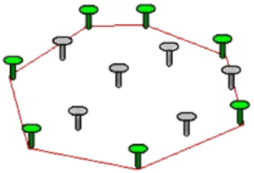
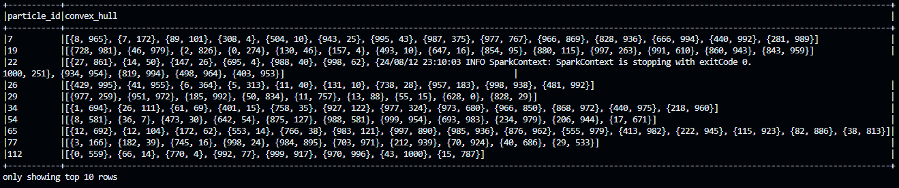

# Overview
### In computational geometry, the `convex hull` of a set of points is the `smallest convex set` (by area, volume, etc.) within which all points lie inside that set of points.



This Spark job calculates the convex hull for a set of 2D points associated with different particles. 

```python
import random
import time
from pyspark.sql import SparkSession
from pyspark.sql.functions import collect_list, struct, col
from scipy.spatial import ConvexHull
from pyspark.sql.types import ArrayType, StructType, StructField, IntegerType

# Initialize Spark session
spark = SparkSession.builder.appName("ConvexHullPerParticle").getOrCreate()

# Generate sample data with 1,000,000 data points
num_points = 1000000
num_particles = 10000  
# set seed for reproducibility
random.seed(0)
data = [(random.randint(1, num_particles), random.randint(0, 1000), random.randint(0, 1000)) for _ in range(num_points)]

# Measure the execution time
start_time = time.time()

# Create DataFrame
columns = ["particle_id", "x", "y"]
df = spark.createDataFrame(data, columns)

# Group by particle_id and collect points
grouped_df = df.groupBy("particle_id").agg(
    collect_list(struct("x", "y")).alias("points")
)

# Define a function to compute convex hull
def compute_convex_hull(points):
    points = [(p['x'], p['y']) for p in points]
    if len(points) < 3:
        return points  # Convex hull is the same as the points if less than 3 points
    hull = ConvexHull(points)
    hull_points = [points[i] for i in hull.vertices]
    return hull_points
# ------------------------------------------------------------
# Register the UDF
hull_schema = ArrayType(StructType([StructField("x", IntegerType()), StructField("y", IntegerType())]))
compute_convex_hull_udf = spark.udf.register("compute_convex_hull", compute_convex_hull, hull_schema)

# Apply the UDF
result_df = grouped_df.withColumn("convex_hull", compute_convex_hull_udf(col("points")))

result_df.select("particle_id", "convex_hull").show(10, truncate=False)

end_time = time.time()
execution_time = end_time - start_time
print(f"Execution time: {execution_time} seconds")

# Stop the Spark session
spark.stop()
```
### Steps Involved:
1. **Data Generation**: Creates a dataset with 1,000,000 points, each associated with one of 10,000 particles.
2. **DataFrame Creation**: Loads the data into a Spark DataFrame with columns `particle_id`, `x`, and `y`.
3. **Grouping Data**: Groups points by `particle_id`, collecting them into lists.
4. **UDF Application**: A User-Defined Function (UDF) computes the convex hull for each particle's points. The UDF is applied to create a new `convex_hull` column in the DataFrame.
5. **Execution Time Measurement**: Measures the time taken to complete the job.

- **`Execution time`**: 31.784100770950317 seconds

## UDF Benefits

- **Custom Processing**: UDFs allow complex, non-SQL operations like convex hull computation.
- **Parallel Processing**: UDFs run in parallel across the Spark cluster, enhancing performance.
- **Integration & Reusability**: UDFs integrate seamlessly with Spark's DataFrame API and can be reused across jobs.
- **Scalability**: Leveraging Spark's distributed processing, UDFs handle large datasets efficiently.


## Experimenting running the same job without using UDF
```python
import random
import time
from pyspark.sql import SparkSession
from pyspark.sql.functions import collect_list, struct
from scipy.spatial import ConvexHull
import pandas as pd

# Initialize Spark session
spark = SparkSession.builder.appName("ConvexHullPerParticleNoUDF").getOrCreate()

# Generate sample data with 1,000,000 data points
num_points = 1000000
num_particles = 10000  
# set seed for reproducibility
random.seed(0)
data = [(random.randint(1, num_particles), random.randint(0, 1000), random.randint(0, 1000)) for _ in range(num_points)]

# Measure the execution time
start_time = time.time()

# Create DataFrame
columns = ["particle_id", "x", "y"]
df = spark.createDataFrame(data, columns)

# Group by particle_id and collect points
grouped_df = df.groupBy("particle_id").agg(
    collect_list(struct("x", "y")).alias("points")
)

# Collect the DataFrame to the driver
grouped_data = grouped_df.collect()

# Define a function to compute convex hull (same as before)
def compute_convex_hull(points):
    points = [(p['x'], p['y']) for p in points]
    if len(points) < 3:
        return points  # Convex hull is the same as the points if less than 3 points
    hull = ConvexHull(points)
    hull_points = [points[i] for i in hull.vertices]
    return hull_points
# ------------------------------------------------------------
# Process each particle's points locally on the driver
results = []
for row in grouped_data:
    particle_id = row['particle_id']
    points = row['points']
    convex_hull = compute_convex_hull(points)
    results.append((particle_id, convex_hull))

# Convert the results back to a Spark DataFrame
result_df = spark.createDataFrame(results, ["particle_id", "convex_hull"])

result_df.show(10, truncate=False)

end_time = time.time()
execution_time = end_time - start_time
print(f"Execution time: {execution_time} seconds")

# Stop the Spark session
spark.stop()
```

- **`Execution time`**: 41.020819664001465 seconds
### Why does it take longer?
- **Collecting Data to Driver**: The `grouped_df.collect()` statement collects the entire DataFrame to the driver node. This operation is expensive and can cause memory issues if the dataset is large. In contrast, when using a UDF, the data remains distributed across the cluster, and the processing happens on the worker nodes.

- **Processing Locally**: The convex hull computation is done locally on the driver for each particle. This approach doesn't leverage Spark's parallel processing capabilities, leading to a potential bottleneck on the driver node.

- **Re-distributing Data**: After processing the data locally, the results are converted back into a Spark DataFrame and distributed across the cluster. This step is redundant and inefficient, as it involves unnecessary data movement between the driver and the cluster.

<!-- ### Benefits of Using UDF (Highlighted by This Example)
- **Distributed Processing:** UDFs allow you to perform the convex hull computation in parallel across the cluster, making the process faster and more scalable. In contrast, processing data locally on the driver node can lead to bottlenecks and memory issues.

- **Scalability:** UDFs can handle large datasets efficiently by keeping the computation distributed. Collecting data to the driver, as shown in this example, limits the scalability of the application.

- **Memory Management:** By keeping the data distributed, UDFs avoid the risk of overwhelming the driver's memory, which can happen when large datasets are collected to the driver.

Using a UDF is significantly more efficient and scalable for this type of operation, as it leverages Spark's distributed processing capabilities, avoids unnecessary data movement, and minimizes the risk of driver node bottlenecks. -->

## Conclusion
Using UDFs in this Spark job is crucial for efficient and scalable convex hull computation. UDFs enable parallel processing, minimize data movement, and avoid driver bottlenecks, making them significantly more effective for large-scale operations.
