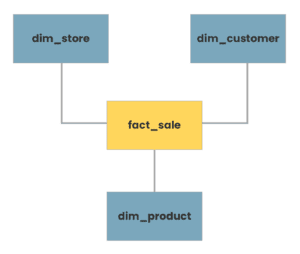
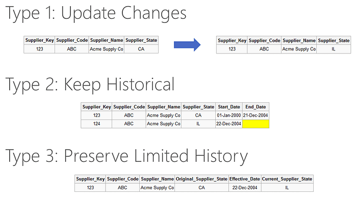
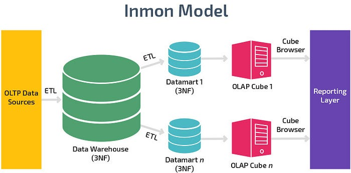
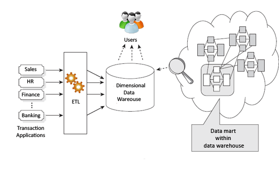
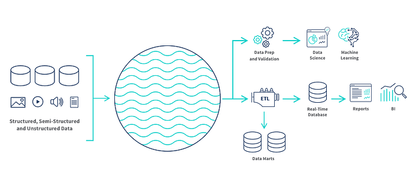
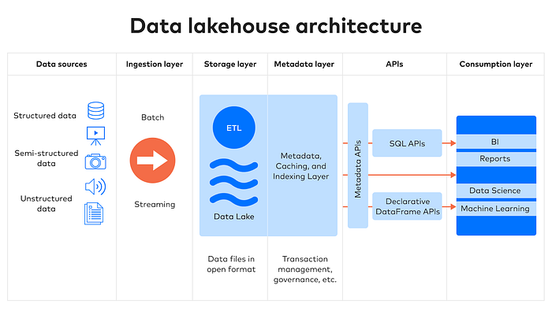

# 1. What is Data Modeling?
- process of conceptualizing and visualizing how data will be captured, stored, and used by an organization. 
- The ultimate aim of data modeling is to establish clear data standards for your entire organization.

## 3 main types of Data Models

- *Conceptual Data Model*: 
    - communicate with stakeholders showing relationships between different entities and defining their essential attributes according to the business requirements
    - represented by ER or UML diagrams
- *Logical Data Mode;*: 
    - refined versions of conceptual data models and incorporate details of cardinality, data types, constraints, validation as proposed by business rules
    - also defined using ER/UML diagrams
- *Physical Data Model*:
    - final version of logical data model which includes all technical features & limitations of the storage option you decide upon
    - specifically optimized for performance, scalability, security, avalability of your data

## Data Modeling techniques
- **Dimensional data modeling**: used for data analytics in Data Warehouses and organizing your data into facts (numerical measures of business events- sales,profit) and dimensions(descriptive attributes that provide context about the fact-order, customer).

- **Data vault data modeling**: enables quick integration of new data sources into existing models
    - insert-only architecture and allows historical record tracking
    - 3 components:
        - a hub (core business entity and unique keys defining it) 
        - a link (relation ship between business keys of 2 or more hubs)
        - a satellite (houses all contextual data about an entity)
        
- **Graph data modeling**: model made for graph databases that represent data that is the form of networks like social media interactions
    - nodes (entities), properties (attributes), edges (relationships)
    

## Important data modeling challenges
- **Normalization/Denormalization**: process of transforming a database to reduce redundancy and increase data integrity and consistency
    - need to apply partitions to a database to make each table simpler with a unique key and clearly defined dependencies to avoid any insert, update or delete errors
    - help to save storage by reducing redundancy and allow data flexibility, scalability, accuracy to make changes without affecting other tables
    - **NOTE**: But this may cause poor performance in retrieving queries through complex joins especially with distributed or large databases. Hence, we could use denormalization to provide quicker retrievals. Although, this would increase the risk of inconsistencies, we need to strike a balance between the two.

- **Slowly changing dimension**: dimension that stores and manages both current and previous version over a history of time period in a data warehouse.
    1. Update changes
    2. Keep Historical
    3. Preserve Limited History
    
- **Change data capture**: process of tracking changes in a database and then capturing them in destination systems
    - keeps all systems in sync and provides reliable data replication with zero downtime data migrations
    
    - get the changes from the log, time or trigger and load and refresh only the changed data

# 2. Data Warehousing
- collecting data from different relevant sources and storing it into a central repository after making neccessary transformations to make data suitable for analytics
- Popular solutions: `Azure Synapse Analytics`, `Amazon Redshift`, `Google BigQuery`

## Features
1. **Historical data storage**
- need to make data driven business decisions
- e.g. in a retail business, a data warehouse can store sales data from previous years, enabling analysts to track trends over time and make informed decisions for future sales strategies

2. **Integration**
- integrate data from multiple sources and formats into a single version of truth enabling data to be less ambihious and have better structured schema
- e.g. a heathcare org can integrate patient data from electronic health records, lab systems, and billing systems into a data warehouse/ 

3. **Data quality**
- DWH stores data after applying certain transformation which involve data cleaning, validation and normalization to make it comaptitble and easy to access by analytics team
- e.g in a financial instituion the transactions maybe in different currencies hence normalization is neccessary to make any comparisons

4. **Data Security**
- access to data only to people who are authorised and there are several encryption and auditing mechanisms to identify any fraudualent activity
- e.g. in an educational system, sensitive info about a student's performance or SSN number and personal details need to be encrypted to prevent harm from attacks 

## Architecture

### Inmon data warehouse architecture
- Bill Inmon believed in a unified source of info which is *non-redundant, clean. structured* =>> **`3NF normalization`** format
- `top-down` approach: data warehouse is broken into department **data marts** reoresenting different systems in a company be it product, sakes, HR, finance,... 
- data is divided according to their specific needs
- Central data warehouse is called **Enterprise Data Warehouse** -> ensure data integrity & consistency

#### Advantages: 
1. **Single source of truth** agreed upon by all departments prior to creation 
2. Easy to model with normalisation and retain in 3NF so **remodeling is not necessary**
3. **Less storage** due to lack of duplication and risk of conflicting values is very low.

#### Disadvantages: 
1. **Slow reporting and querying** with more joins due to normalization. 
2. **Lenghty upfront work of organizing data** and decide which business rules to apply in the enterprise data warehouse. 
3. The **combination** of data from different departments for analysis would be **difficult**.

#### E.g. `In manufacturing, the data related to inventory, man hours, sales, products is all interrelated and hence here the use of a centralised data storage with Inmon approach would make sense.`

### Kimball data warehouse architecture
- focused on making data marts with dimensional data modeling according to specific business requirements 
- once all the data had been loaded into data marts, it would combined inside the the data warehouse
- `bottom` approach: key features of the data are first analysed according to the critical business processes and questions followed by relevant ETL and storage into **star** or **snowflake** schemas

#### Advantages: 
1. **Fast and incremental** building of data warehouse for rapid reporting where the users are involved in the design process. 
2. The **denormalised version is preffered** to make user querying effiecient. 
3. The **star schema is flexible and extensible** to accomodate change in business changes.

#### Disadvantages: 
1. **Complex ETL** due to denormalization and thus will be time consuming. 
2. **Data will be redundant** in different data marts and may have **conflicting truths**. 
3. **Maintainence** would be **difficult** because of incremental development efforts.

#### E.g. `Marketing is a specialised field and you will only need to look at certain information and not the overall view, therefore in this case, a Kimball architecture would be appropriate`

# 3. Data Lake
- Popular solutions: `Azure Data Lake`, `Amazon S3`, `Apache Hadoop`
- data storage that holds all of the structured, semi, unstructured data in a centralized repository and stores data in its *raw* format without any preprocessing
- need to create unique identifiers and tags to data elements so that you can query a portion of data for analysis requirements
- good scalability
- Properties:
    - schema-on read *only define the schema while retrieving data
    - more cost effective in terms of storage shelf life a
    - fast implementation because of no transformations
- DWH can archive historical data into data lake to make its queries faster & optimized
- support different types of connectors that **support batch and stream ingestion** of data and provide **governance capabilities** on controlling what data goes into the data lake and how to manage it

- E.g. `In supply chain, the details about suppliers can be hidden in multiple systems and it would be hard to spot any issues or pinpoint problems. And if we use data from a data lake collecting information from internal sources like supplier data,internal ordering and shipper data and external data sources like weather predictions, then we can get identify the delay causes and bottlenecks.`

# 4. Data Lakehouse
- combination of flexibility of a data lake and the management of a data warehouse 
- facililated through a transaction layer that is responsible for ensuring **ACID** compliance (`atomic`, `consistent`, `isolated`, and `durable`) and concurrent reads and write using data formats such as Parquet, ORC and Avro
    - ACID compliance supports data governance and privacy regulations(GDPR) along with efficient access
- provides features of adding metadata, caching and indexing that enables optimization of performance, accessibility and usability
